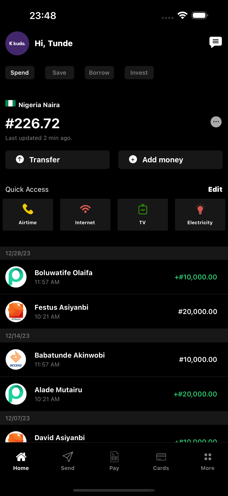
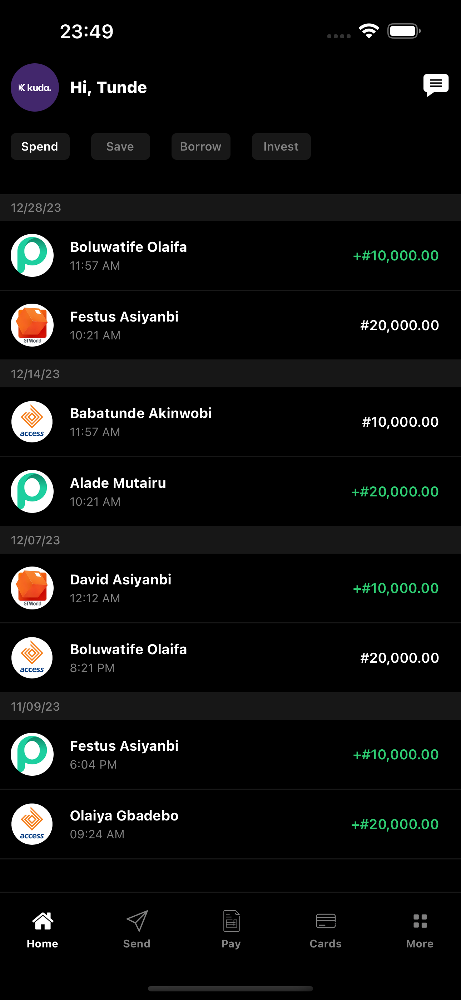

# Kuda App Clone

## Overview
This project is a React Native clone of the home page of the Kuda Finance app. It replicates the user interface and design elements of the original app's home screen.

## Features
- Quick Access: I worked on the quick access sectio of the app which allow users have access to common features like Airtime, Internet, TV, and Electricity payments with just a tap
- Stylish Icons: I downloaded some png files from [Flaticon](https://www.flaticon.com/) and used in place of react-native-vector-icons

## Screenshots

## Prerequisites to launch app

- Ensure [Node.js](https://nodejs.org/en) is installed on your machine
- Follow the [React Native CLI set up instructions](https://reactnative.dev/docs/environment-setup)

## Getting Started

- Clone the repository:
`git clone https://github.com/festusasiyanbi/kuda-finance-clone.git`

- Navigate to project directory
`cd kuda_app_clone`

- Install all dependencies
`npm install`

- To run on iOS
`npm run ios` or `npx react-native run-ios`
NB: The default simulator for the iOS is iPhone 15 Pro Max, you can edit this in the `package.json` file

- To run on Android
`npm run android` or `npx react-native run-android`
